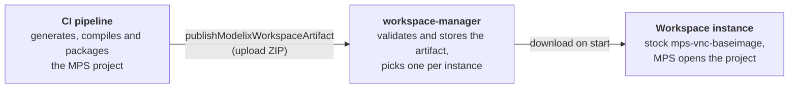

# Publishing MPS builds to Modelix workspaces from Gradle

Your existing CI pipeline builds the MPS project, and the Gradle plugin `org.modelix.workspaces` uploads the result
to a Modelix workspace. Instances of that workspace then run exactly what CI built.
Nothing is generated, compiled or built as a Docker image inside the Kubernetes cluster.

This is the build mode **External (CI pipeline)** (`EXTERNAL`).
The other build mode, **Inside the cluster** (`IN_CLUSTER`), clones the git repositories and builds the modules
in a Kubernetes job. External builds help when:

- the project needs a build setup the in-cluster job can't reproduce (custom Gradle logic, private dependencies,
  generated plugins)
- CI already builds the project, and building it a second time in the cluster wastes time and resources
- the workspace should run a specific, tested build, for example the build of a release or of the main branch

The reference of the plugin is [workspace-gradle-plugin/README.md](../workspace-gradle-plugin/README.md).

## How it works



When an instance starts, it runs the unmodified `modelix/mps-vnc-baseimage` for the artifact's MPS version.
A startup script downloads the artifact and the Modelix plugins and installs them before MPS starts.
The instance uses the first of these that exists:

1. the artifact selected explicitly for the instance (its `artifactId`)
2. for an instance of a git draft, the newest artifact built from the draft's base commit
3. the newest artifact of the workspace

Without any artifact, the instance waits in the state `WAITING_FOR_BUILD` and starts as soon as one is uploaded.

## Setting up a workspace

The workspace must have the build mode **External (CI pipeline)**.
A git repository is optional: the instance runs the uploaded project, not a clone.

1. Open the dashboard (`/modelix/dashboard/`), go to the workspaces page and click **New Workspace**.
2. Enter a name and choose the MPS version your CI builds with.
   Images exist for the versions listed in `mpsMajorVersions` in [gradle.properties](../gradle.properties).
3. Set **Build** to **External (CI pipeline)**. Leave **Git Repository** empty unless instances should also work on
   git drafts of a repository.
4. Create the workspace. Its ID is the last segment of the URL, `/modelix/dashboard/workspaces/workspaces/<workspace-id>`.

The build mode of an existing workspace can be changed in its edit form.
The **Artifacts** section of a workspace only appears in the `EXTERNAL` mode.
It lists the uploaded builds and has the **Upload Token** button.

The workspace can also be created through the REST API: `POST /modelix/workspaces/workspaces/` with
`{"id": "", "name": "my-workspace", "mpsVersion": "2024.1", "buildMode": "EXTERNAL"}`.
The response contains the generated ID.

## Configuring the Gradle plugin

Apply `org.modelix.workspaces` in the build that builds your MPS project,
and point it at the workspace and the folders to upload.
The plugin version matches the version of the Modelix Helm chart.
It is published to the itemis Maven repository, runs on Java 11 or newer, and has no dependencies,
so it doesn't conflict with other plugins in your build.

```kotlin
// settings.gradle.kts
pluginManagement {
    repositories {
        maven { url = uri("https://artifacts.itemis.cloud/repository/maven-mps/") }
        gradlePluginPortal()
    }
}
```

```kotlin
// build.gradle.kts
plugins {
    id("org.modelix.workspaces") version "<version of the Modelix Helm chart>"
}

modelixWorkspace {
    serverUrl = "https://modelix.example.com/"
    workspaceId = "6f1d2c3e-..."
    mpsVersion = "2024.1"

    // Whatever task generates and compiles your MPS project. Runs before the artifact is packaged.
    dependsOn("build")

    // The folder containing the .mps folder. Opened as a project in MPS.
    mpsProject("my-project", layout.projectDirectory.dir("mps"))

    // Optional: modules the project depends on, registered as a global library
    languages { from(layout.buildDirectory.dir("dependencies")) }

    // Optional: IDEA/MPS plugins (folders or ZIP files), installed before MPS starts
    plugins { from(layout.buildDirectory.dir("plugins")) }
}
```

The uploaded project must already be generated and compiled (`source_gen`, `classes_gen`, or packaged JARs).
The instance doesn't run make or generation, so a language without compiled classes doesn't load.
For finer control over what goes into a project, use
`mpsProject("my-project") { from("mps") { exclude("**/tmp/**") } }`.

| Property                                     | Default                                                                                                          | Meaning                                                                                       |
|----------------------------------------------|------------------------------------------------------------------------------------------------------------------|-----------------------------------------------------------------------------------------------|
| `serverUrl`                                  | (required)                                                                                                       | Base URL of the Modelix installation                                                          |
| `workspaceId`                                | (required)                                                                                                       | ID of the workspace to upload to                                                              |
| `mpsVersion`                                 | MPS version of the workspace                                                                                     | Major version the project was built with, e.g. `2024.1`. Instances start with this version.  |
| `accessToken`                                | env `MODELIX_ACCESS_TOKEN`                                                                                       | Upload token or another token with the upload permission                                      |
| `oauth { clientId; clientSecret; tokenUrl }` | secret from env `MODELIX_OAUTH_CLIENT_SECRET`, token URL `<serverUrl>/realms/modelix/protocol/openid-connect/token` | Requests a token with OAuth client credentials instead of `accessToken`                       |
| `gitCommit`, `gitBranch`                     | detected from CI variables or `git`                                                                              | Used to choose the artifact for git drafts                                                    |
| `label`                                      | the Gradle project's version                                                                                     | Free text shown in the dashboard, e.g. a build number                                         |
| `maxUploadAttempts`                          | 3                                                                                                                | Retries on network errors and HTTP 502/503/504                                                |

| Task                                       | What it does                                                                                  |
|--------------------------------------------|-----------------------------------------------------------------------------------------------|
| `generateModelixWorkspaceArtifactManifest` | Writes `modelix-artifact.json` (MPS version, git commit and branch, label)                    |
| `packageModelixWorkspaceArtifact`          | Creates `build/modelix/workspace-artifact.zip`                                                |
| `publishModelixWorkspaceArtifact`          | Uploads the ZIP and writes the server's response to `build/modelix/published-artifact.json`   |

## Authentication

Uploading requires the permission `workspaces/workspace/<id>/build-result/write`,
which the maintainers and owners of a workspace have. A CI pipeline gets it in one of two ways.

**Upload token (simplest).** The token is only valid for uploading artifacts to this one workspace.
A maintainer creates it with the **Upload Token** button in the workspace's Artifacts section, or with the REST API:

```shell
curl -X POST -H "Authorization: Bearer $YOUR_TOKEN" -H "Content-Type: application/json" \
  -d '{"validityDays": 90}' \
  https://modelix.example.com/modelix/workspaces/workspaces/<workspace-id>/artifact-upload-token
```

- Validity: 90 days by default, 1 to 365 days.
- Creating a token requires `workspaces/workspace/<id>/config/write`, so an upload token can't create further tokens.
- Store it as a CI secret and expose it as the environment variable `MODELIX_ACCESS_TOKEN`.

**OAuth client credentials.** Create a Keycloak client with a service account in the realm `modelix`.
Then grant the upload permission to the user `service-account-<client-id>` on the workspace-manager's permission page.

```kotlin
modelixWorkspace {
    oauth {
        clientId = "my-ci-pipeline"
        // clientSecret defaults to the environment variable MODELIX_OAUTH_CLIENT_SECRET
    }
}
```

## Running it in CI

Add `publishModelixWorkspaceArtifact` as the last step of the pipeline that builds the MPS project.
A GitHub Actions job that publishes every build of `main`:

```yaml
on:
  push:
    branches: [main]

jobs:
  publish:
    runs-on: ubuntu-latest
    steps:
      - uses: actions/checkout@v4
      - uses: actions/setup-java@v4
        with:
          distribution: temurin
          java-version: 17
      - run: ./gradlew publishModelixWorkspaceArtifact
        env:
          MODELIX_ACCESS_TOKEN: ${{ secrets.MODELIX_ACCESS_TOKEN }}
```

The plugin records the git commit and branch in the artifact.
It reads them from the variables of GitHub Actions, GitLab, Jenkins, Azure Pipelines, Bitbucket Pipelines and TeamCity,
or else by calling `git`. Override them with `gitCommit` and `gitBranch`.

The commit matters for **git drafts**. An instance of a draft uses the newest artifact built from the draft's base commit.
Pull request builds usually check out a merge commit that exists on no branch,
so publish artifacts from branch builds (on push) to make them usable for drafts.

## Artifact format and limits

An artifact is a ZIP file. The plugin creates it, but any build tool can produce it and upload it with
`POST /modelix/workspaces/workspaces/<id>/artifacts/upload`
(`Content-Type: application/zip`, response 201 with the stored artifact as JSON).

| Entry                   | Content                                                                                                           | Where it goes in the instance                     |
|-------------------------|-------------------------------------------------------------------------------------------------------------------|---------------------------------------------------|
| `modelix-artifact.json` | Optional manifest: `{"formatVersion": 1, "mpsVersion": "2024.1", "gitCommit": "...", "gitBranch": "...", "label": "..."}` | Read by the workspace-manager                     |
| `mps-projects/<name>/`  | MPS projects, at least one                                                                                        | `/mps-projects/<name>`, opened when MPS starts    |
| `mps-languages/`        | Additional modules                                                                                                | `/mps-languages`, a global library                |
| `mps-plugins/`          | IDEA/MPS plugins, folders or ZIP files                                                                            | Installed into `/mps/plugins` before MPS starts   |

The workspace-manager rejects any other top-level entry, as well as absolute paths and `..`.
`mpsVersion` must be a major version such as `2024.1`.

Two Helm values control the server side:

- `workspaces.artifacts.maxUploadSize`: maximum upload size in MiB, default 2048.
  A separate ingress for the upload path carries this limit.
- `workspaces.artifacts.maxArtifactsPerWorkspace`: default 20.
  Older artifacts are deleted automatically unless an instance uses them.

## Example project and local testing

[workspace-gradle-plugin/example](../workspace-gradle-plugin/example) is a complete, small MPS 2024.1 project
built like a CI build would build it:

1. `org.modelix.mps.build-tools` downloads MPS, then generates and compiles the modules in place
   (`assembleMpsModules`, needs `ant` on the `PATH`).
2. `org.modelix.workspaces` packages and uploads the project. It is taken from the repository's sources with
   `includeBuild("../..")`, so changes to the plugin are picked up without publishing it.

To run it against a local cluster, create an `EXTERNAL` workspace and an upload token in the dashboard, then:

```shell
cd workspace-gradle-plugin/example
MODELIX_ACCESS_TOKEN=<token> ./gradlew publishModelixWorkspaceArtifact -Pmodelix.workspaceId=<workspace-id>
```

The example uploads to `http://localhost/` by default; `-Pmodelix.serverUrl=...` selects another installation.
Plain HTTP is used because Java doesn't trust the self-signed certificate of a local cluster.
Then launch an instance of the workspace: MPS opens the project `git-import-test-repo`.

## Troubleshooting

| Symptom                                          | Cause and fix                                                                                                                   |
|--------------------------------------------------|---------------------------------------------------------------------------------------------------------------------------------|
| Upload fails with 401                            | The token is missing, invalid or expired. Check `MODELIX_ACCESS_TOKEN` or the OAuth client.                                      |
| Upload fails with 403                            | The token lacks `build-result/write` for this workspace. Upload tokens are bound to the workspace they were created for.         |
| Upload fails with 404                            | The workspace ID is wrong.                                                                                                      |
| Upload fails with 413                            | The ZIP exceeds `workspaces.artifacts.maxUploadSize`. Exclude build caches, or raise the limit.                                  |
| `Invalid MPS version`                            | `mpsVersion` must be a major version (`2024.1`), not a full one (`2024.1.4`).                                                   |
| Upload fails with `PKIX path building failed`    | Java doesn't trust the server's certificate. Use a trusted certificate, or for a local cluster `http://localhost/`.              |
| Instance stays in `WAITING_FOR_BUILD`            | No artifact was uploaded yet. Instances start as soon as one is.                                                                |
| MPS starts, but a language doesn't load          | The artifact contains sources only. Generate and compile the modules before packaging.                                          |
| noVNC shows "Reconnecting…" on a local cluster   | The browser refused the `wss://` connection because of the self-signed certificate. Reload the dashboard and accept the certificate again. |
